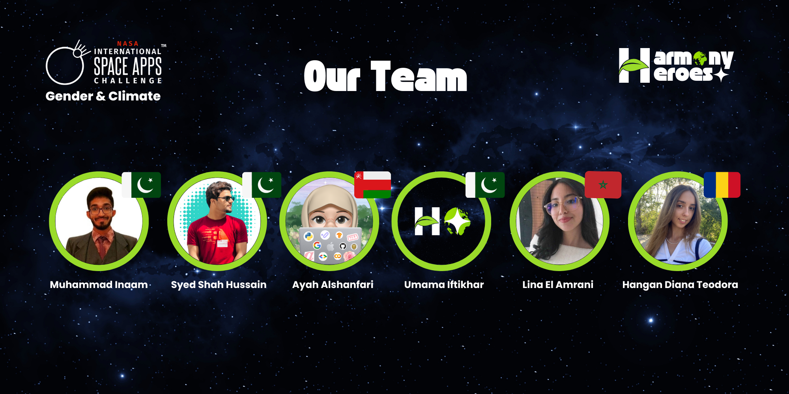

 
# 
<b>Harmony Heroes: Bridging Gender Equality and Climate Action</b>

# 

## Introduction 🌍

The United Nations Sustainable Development Goals (SDGs) provide a blueprint for peace and prosperity for people and the planet. Among these goals, **SDG 5: Gender Equality** and **SDG 13: Climate Action** are crucial. This project aims to explore the intersection of climate change and gender inequality, showcasing how these issues are interlinked and proposing solutions that promote equality and sustainable development for all.

## Problem Statement & Solution 🛠️

**Challenge:** Climate refugees face increasing vulnerability due to the lack of legal recognition, insecure living conditions, and inadequate access to resources. Gender inequality worsens these challenges, as women disproportionately bear the brunt of climate-related displacement. Our project addresses the need for a global solution that bridges gender equity with climate action.

### Objectives 🎯

**Harmony Heroes** creates an interactive website that not only models the intersection of gender inequality and climate displacement but also provides resources and real-time support to affected individuals. It incorporates a 3D visualization of climate refugee data, mentorship programs, healthcare support, and partnerships for distributing essential hygiene products to women refugees.

### Proposed Solutions 💡

**Harmony Heroes** creates an interactive website that not only models the intersection of gender inequality and climate displacement but also provides resources and real-time support to affected individuals. It incorporates a 3D visualization of climate refugee data, mentorship programs, healthcare support, and a way for distributing essential hygiene products to women refugees.

## **What Problem Does It Solve?** 

**Harmony Heroes** addresses the dual challenge of climate displacement and gender inequality by providing a comprehensive digital platform for climate refugees. Through real-time data modeling, community support, and access to essential resources, we aim to mitigate the gendered impacts of climate change and promote sustainable development.

---

## **What Do People Gain?**

- **Climate Refugees** gain access to mentorship programs, essential health resources, and a supportive community where their voices are heard. 🤝
  
- **Researchers** gain access to open-source data on climate and gender intersections, fostering further study and policy recommendations. 📊
  
- **Global Users** gain awareness of the growing issue of climate refugees and can contribute to ongoing efforts through donations, advocacy, and community support. 🌐

---

## **Where is the Opportunity?**

🚀 **Harmony Heroes** offers a unique opportunity to bridge the gap between climate change action and gender equality by empowering the most vulnerable populations—women climate refugees. With a platform designed to educate, support, and mobilize, our solution encourages collaboration across sectors to address this humanitarian crisis.

## **Key Features:**

1. **3D Earth Visualization:** 🌎 
   Our platform features an interactive globe where users can explore global data on climate refugee displacement. By clicking on different regions, users can view visualized data on displacement patterns and the specific gender-based challenges refugees face.

2. **Mentorship Programs:** 💬  
   A mentorship network specifically designed for women refugees, offering emotional support, skill-building, and practical advice. The program will include a live Discord chat for real-time communication.

3. **Health and Hygiene Resources:** 🏥 
   We provide vital information on accessing healthcare, mental health, and reproductive health services.

## Targeted SDGs 🌱

### SDG 5: Gender Equality

Promoting gender equality is essential for sustainable development. Our project highlights how climate change disproportionately impacts gender minorities and proposes solutions to address these disparities.

### SDG 13: Climate Action

Addressing climate change is crucial for the survival of marginalized communities. Our solutions aim to mitigate climate impacts while promoting gender equity.

### SDG 3: Good Health and Well-being  

Providing access to healthcare resources, mental health support, and reproductive health for displaced women contributes to SDG 3, promoting well-being for all. ❤️

### SDG 17: Partnerships for the Goals  

Harmony Heroes promotes collaboration between NGOs, community organizations, and global networks to ensure comprehensive support for climate refugees, aligning with SDG 17. 🤝

---

## Into The Future 🚀

### What Will Your Idea Change?
Our project will enhance understanding of the intersection between climate change and gender inequality, leading to informed decision-making and effective solutions for affected communities.

### What Can Your Solution Do For The People?
By addressing these intertwined issues, our project aims to empower communities to adapt and thrive in the face of climate challenges, fostering a more equitable and sustainable future.

## Research Document 📖
[View our Research Document here!](https://drive.google.com/file/d/1vCoi1i2jDCfKnCEeo7w42QMTQQiICFKU/view?usp=sharing)

## Presentation Slides 🎤
[Check out our presentation slides here!](https://drive.google.com/file/d/1x5Hhx7eCJfDfheb2qK2uzIznVTYiNaAY/view?usp=sharing)

## Website 🌐
[Visit our website here!](https://harmony-heroes.vercel.app/)

## Final Video 🎥
[Watch our final video here!]()

## Our Amazing Team 👩‍👩‍👧‍👦

